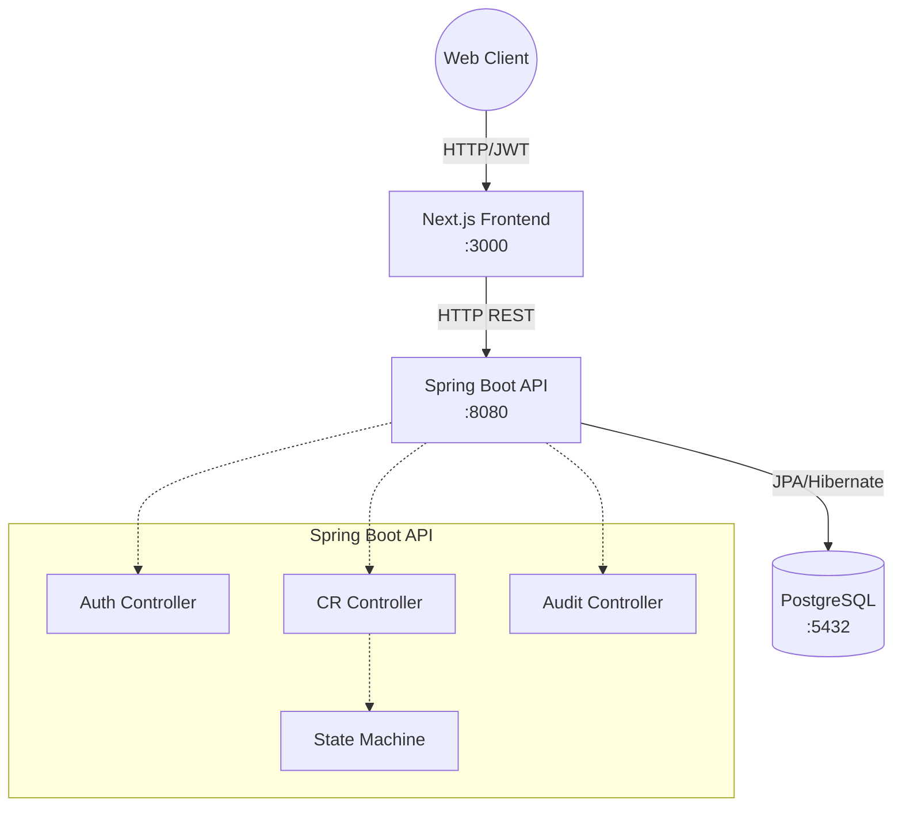

# RelayDesk - Engineering Change Request & Release Gate Platform

> **Note on Updates:** 
> This version includes several critical fixes and architectural improvements over the original [relaydesk-ticketing repository](https://github.com/mkaif03/relaydesk-ticketing):
> - **Changed:** Fully migrated the Next.js frontend to Server Components (RSC) to minimize client-side javascript, handling cookie proxying (`rd_at`) for authentication.
> - **Changed:** Fixed State Machine vulnerabilities: blocked self-approvals, strictly isolated the `SHIPPED` status to the release service, and enforced RBAC at all transition endpoints.
> - **Changed:** Implemented true Optimistic Locking with custom `409 Conflict` exceptions for concurrent edits.
> - **Changed:** Added backend pagination, dynamic filtering, and a filter UI to the Change Request dashboard.
> - **Changed:** Updated the database seed script to provide all 7 user roles and changed the default passwords to `password`.
> - **Left Out:** Eplicitly deleted all AI-generated logs, `CLAUDE.md`, and `AGENTS.md` that were lingering in the previous repository version. Also intentionally skipped implementing File Attachments, Webhooks, SSE, and Rate Limiting to focus entirely on core workflow stability.

## Overview

RelayDesk is an Engineering Change Request (CR) and Release Gate Platform designed to track, review, and schedule changes before they hit production. It provides strict Role-Based Access Control (RBAC), auditing, and an approval state machine.

## How to Run

Running the app is trivial via Docker Compose. It will spin up PostgreSQL, the Spring Boot API, and the Next.js Frontend.

```bash
# From the root directory:
docker compose up --build -d
```

Once running:
- **Web UI:** http://localhost:3000
- **API / Swagger UI:** http://localhost:8080/swagger-ui.html

## Seed Users

A default set of seed users are created on initialization to test different roles. The password for all accounts is `password`:
- **Alice Admin (ROLE_ADMIN):** `admin@relaydesk.dev`
- **Bob Reviewer (ROLE_REVIEWER):** `reviewer1@relaydesk.dev`
- **Carol Reviewer (ROLE_REVIEWER):** `reviewer2@relaydesk.dev`
- **Dave Engineer (ROLE_ENGINEER):** `eng1@relaydesk.dev`
- **Eve Engineer (ROLE_ENGINEER):** `eng2@relaydesk.dev`
- **Frank Engineer (ROLE_ENGINEER):** `eng3@relaydesk.dev`
- **Grace Manager (ROLE_RELEASE_MANAGER):** `manager@relaydesk.dev`

## Architecture Diagram



- **Backend:** Spring Boot 3.3 (Java 21), Spring Security, Spring Data JPA
- **Database:** PostgreSQL 16 (with Flyway for migrations)
- **Frontend:** Next.js 15 (App Router, Tailwind CSS, Lucide Icons)
- **Auth:** JWT stored in `httpOnly` cookies

## What Was Cut (Known Gaps)

Due to scope constraints, the following features were cut:
- **File Attachments:** Uploading PDFs/Images to a CR.
- **Webhooks & Email Notifications:** Outbound alerts on CR status changes.
- **Server-Sent Events (SSE):** Real-time dashboard updates without polling.
- **CSV Export:** Exporting release manifests.
- **Rate Limiting:** Protection on login/refresh endpoints.

## Known Bugs
- **Dashboard Counts:** The dashboard currently does not actively poll; you must refresh to see status updates.
- **Audit Log Deletions:** Audit logs are currently kept indefinitely without a TTL or archival process.
- **Token Expiry Edge Case:** If the `httpOnly` cookie expires while a user is typing a long CR description, submission might fail with a 401 instead of smoothly auto-refreshing in the background.
