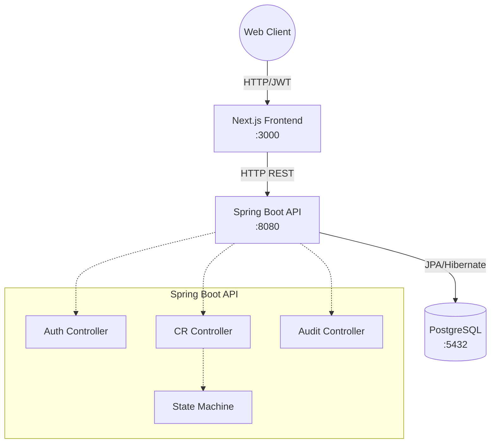

# RelayDesk - Engineering Change Request & Release Gate Platform

## Overview

RelayDesk is an Engineering Change Request (CR) and Release Gate Platform designed to track, review, and schedule changes before they hit production. It provides strict Role-Based Access Control (RBAC), auditing, and an approval state machine.

## How to Run

Running the app is trivial via Docker Compose. It will spin up PostgreSQL, the Spring Boot API, and the Next.js Frontend.

```bash
# From the root directory:
docker compose up --build -d
```

Once running:
- **Web UI:** http://localhost:3000
- **API / Swagger UI:** http://localhost:8080/swagger-ui.html

## Seed Users

A default set of seed users are created on initialization to test different roles:
- **Admin:** `admin@relaydesk.dev` / `Relay!2026` (Full access, including Audit Logs)
- **Reviewer:** `reviewer@relaydesk.dev` / `Relay!2026` (Can approve/reject CRs)
- **Engineer:** `engineer@relaydesk.dev` / `Relay!2026` (Can create and view CRs)

## Architecture Diagram



- **Backend:** Spring Boot 3.3 (Java 21), Spring Security, Spring Data JPA
- **Database:** PostgreSQL 16 (with Flyway for migrations)
- **Frontend:** Next.js 15 (App Router, Tailwind CSS, Lucide Icons)
- **Auth:** JWT stored in `httpOnly` cookies

## What Was Cut (Known Gaps)

Due to scope constraints, the following features were cut:
- **File Attachments:** Uploading PDFs/Images to a CR.
- **Webhooks & Email Notifications:** Outbound alerts on CR status changes.
- **Server-Sent Events (SSE):** Real-time dashboard updates without polling.
- **CSV Export:** Exporting release manifests.
- **Rate Limiting:** Protection on login/refresh endpoints.

## Known Bugs
- **Dashboard Counts:** The dashboard currently does not actively poll; you must refresh to see status updates.
- **Audit Log Deletions:** Audit logs are currently kept indefinitely without a TTL or archival process.
- **Token Expiry Edge Case:** If the `httpOnly` cookie expires while a user is typing a long CR description, submission might fail with a 401 instead of smoothly auto-refreshing in the background.
